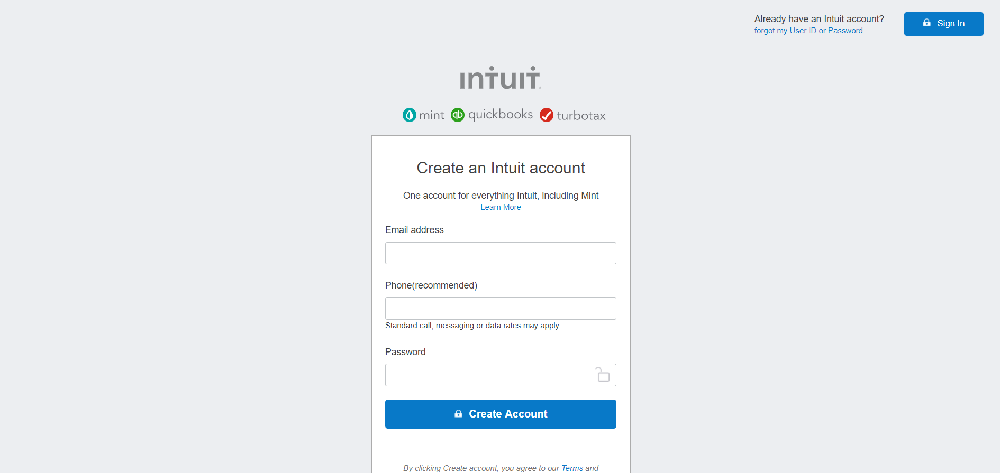

<<<<<<< HEAD
# Project : HTML FORMS ( Mint sign up page clone ) 

> We created a clone of a Mint's Signup page, with input form for the creation of a new account.
=======
# Project Name
HTML FORMS:Mint sign up page clone
> 
>>>>>>> feature

## Built With

- HTML and css,

<<<<<<< HEAD
## Live Demo

[Live Demo Link](https://rawcdn.githack.com/Lidya1234/HTML_FORMS/e7766389db3bd9c65882b551822a9463d20630cf/index.html)
=======

## Live Demo

[Live Demo Link]
(https://rawcdn.githack.com/Lidya1234/HTML_FORMS/e7766389db3bd9c65882b551822a9463d20630cf/index.html
)

>>>>>>> feature

## Authors

👤 **Author1**

- Github: [@khalilhamdii](https://github.com/khalilhamdii)

👤 **Author2**

- Github: [@Lidya1234](https://github.com/Lidya1234)

## 🤝 Contributing

Contributions, issues and feature requests are welcome! Start by:

Feel free to check the [issues page](issues/).

Forking the project
Cloning the project to your local machine
cd into the project directory
Run git checkout -b your-branch-name
Make your contributions
Push your branch up to your forked repository
Open a Pull Request with a detailed description to the development branch of the original project for a review
<<<<<<< HEAD

## Show your support

Give a ⭐️ if you like
=======

## Show your support

Give a ⭐️ if you like this project!
And you are welcome to leave any helpful comments to help us develop a better version of this webpage.
>>>>>>> feature
